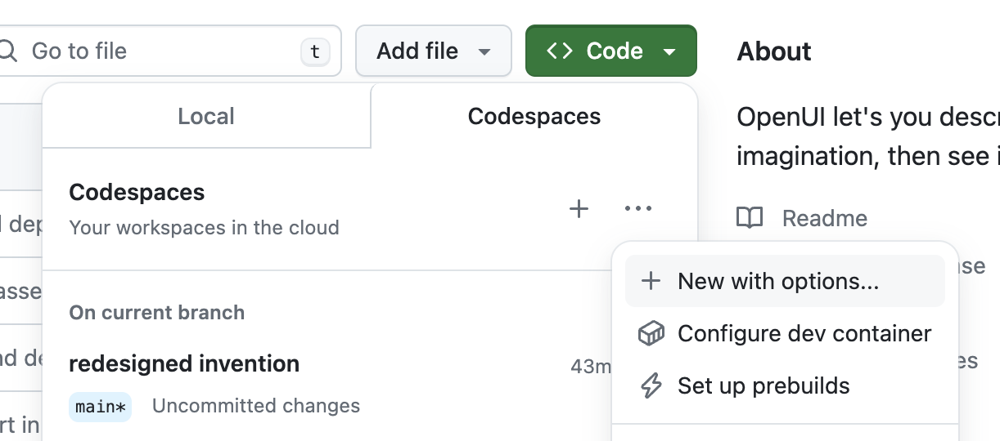

# EldoraAI

<p align="center">
  
</p>

Building UI components can be a slog.  OpenUI aims to make the process fun, fast, and flexible.  It's also a tool we're using at [W&B](https://wandb.com) to test and prototype our next generation tooling for building powerful applications on top of LLM's.


> **DISCLAIMER:** under development

## Overview


EldoraAI let's you describe UI using your imagination, then see it rendered live. You can ask for changes and convert HTML to React, Svelte, Web Components, etc.  It's like [v0](https://v0.dev) but open source.

## Running Locally

EldoraAI supports [OpenAI](https://platform.openai.com/api-keys), [Groq](https://console.groq.com/keys), and any model [LiteLLM](https://docs.litellm.ai/docs/) supports such as [Gemini](https://aistudio.google.com/app/apikey) or [Anthropic (Claude)](https://console.anthropic.com/settings/keys).  The following environment variables are optional, but need to be set in your environment for alternative models to work:

- **OpenAI** `OPENAI_API_KEY`
- **Groq** `GROQ_API_KEY`
- **Gemini** `GEMINI_API_KEY`
- **Anthropic** `ANTHROPIC_API_KEY`
- **Cohere** `COHERE_API_KEY`
- **Mistral** `MISTRAL_API_KEY`
- **OpenAI Compatible** `OPENAI_COMPATIBLE_ENDPOINT` and `OPENAI_COMPATIBLE_API_KEY`


### From Source / Python

Assuming you have git and [uv](https://github.com/astral-sh/uv) installed:

```bash
git clone https://github.com/karthikmudunuri/eldoraai
cd openui/backend
uv sync --frozen --extra litellm
source .venv/bin/activate
# Set API keys for any LLM's you want to use
export OPENAI_API_KEY=xxx
python -m openui
```

### Codespace



Choose more options when creating a Codespace, then select **New with options...**.  Select the US West region if you want a really fast boot time.  You'll also want to configure your OPENAI_API_KEY secret or just set it to `xxx` if you want to try Ollama *(you'll want at least 16GB of Ram)*.

Once inside the code space you can run the server in one terminal: `python -m openui --dev`.  Then in a new terminal:

```bash
cd /workspaces/eldoraai/frontend
npm run dev
```

This should open another service on port 5173, that's the service you'll want to visit.  All changes to both the frontend and backend will automatically be reloaded and reflected in your browser.

### Resources

See the readmes in the [frontend](./frontend/README.md) and [backend](./backend/README.md) directories.
